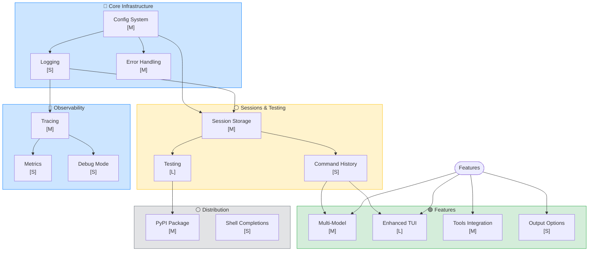
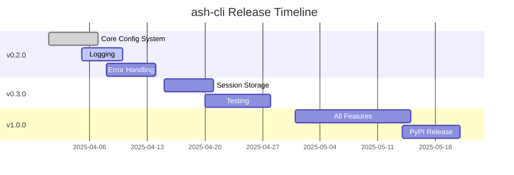

# ash-cli Roadmap

## Project Status

- **Type**: Local AI CLI agent using Agno + Qwen3.5-4B via llama.cpp
- **Current**: Outputs bash commands with streaming TUI, execute/copy options
- **Files**: 6 modules (config, agent, tui, buffer, __main__, __init__)

## Legend

| Node Color | Status |
|-----------|--------|
| 🟢 Green | Complete |
| 🔵 Blue | In Progress / Current |
| ⚪ Gray | Planned / Not Started |

| Effort | Complexity |
|--------|------------|
| [S] Small | < 1 day |
| [M] Medium | 1-3 days |
| [L] Large | > 3 days |

---

## Dependency Graph



---

## Phase 1: Core Infrastructure

```mermaid
flowchart LR
    subgraph Config[Config System [M]]
        A[".env support"] --> B[CLI Args]
        B --> C[Config file]
    end

    subgraph Logging[Logging [S]]
        D[Log levels] --> E[JSON output]
        E --> F[File rotation]
    end

    subgraph Error[Error Handling [M]]
        G[Connection errors] --> H[Retry logic]
        H --> I[Graceful degradation]
    end

    style Config fill:#fff3cd,stroke:#ffc107
    style Logging fill:#d4edda,stroke:#28a745
    style Error fill:#fff3cd,stroke:#ffc107
```

### Config System [M]

- [ ] .env file support
- [ ] CLI arguments (`--model`, `--temp`, etc.)
- [ ] Config file (YAML/JSON)

### Logging [S]

- [ ] Log levels (debug, info, warning, error)
- [ ] JSON structured output
- [ ] Log file rotation with size limit
- [ ] Configurable format

### Error Handling [M]

- [ ] Connection error handling
- [ ] Retry logic with backoff
- [ ] Graceful degradation
- [ ] Input validation

---

## Phase 2: Sessions & Testing

```mermaid
flowchart LR
    A[Session Storage [M]] --> B[History]
    B --> C[Search]
    A --> D[Export/Import]
    
    E[Testing [L]] --> F[Unit Tests]
    F --> G[Integration Tests]
    G --> H[CI/CD]
    
    style A fill:#fff3cd,stroke:#ffc107
    style B fill:#e2e3e5,stroke:#6c757d
    style E fill:#fff3cd,stroke:#ffc107
```

### Session Storage [M]

- [ ] Persist to file (JSON/SQLite)
- [ ] Load previous sessions
- [ ] Session naming
- [ ] Export/import

### Testing [L]

- [ ] Add pytest
- [ ] Unit tests (config, agent, buffer)
- [ ] Integration tests
- [ ] GitHub Actions CI

---

## Phase 3: Features

```mermaid
flowchart LR
    A[Multi-Model [M]] --> B[Model Presets]
    C[Enhanced TUI [L]] --> D[Shortcuts]
    D --> E[Completions]
    F[Tools [M]] --> G[Git Tools]
    G --> H[Custom Tools]
    
    style A fill:#e2e3e5,stroke:#6c757d
    style C fill:#e2e3e5,stroke:#6c757d
    style F fill:#e2e3e5,stroke:#6c757d
```

### Multi-Model [M]

- [ ] Multiple model support
- [ ] Model switching
- [ ] Model presets

### Enhanced TUI [L]

- [ ] Keyboard shortcuts (vim bindings)
- [ ] Command completions
- [ ] Better scroll
- [ ] Themes

### Tools Integration [M]

- [ ] Git operations
- [ ] File previews
- [ ] Custom tools registration

---

## Phase 4: Observability

```mermaid
flowchart LR
    A[Tracing [M]] --> B[Token tracking]
    B --> C[Latency metrics]
    A --> D[Session telemetry]
    
    E[Metrics [S]] --> F[Usage stats]
    F --> G[API counts]
    
    H[Debug Mode [S]] --> I[Verbose output]
    I --> J[Payload dump]
    
    style A fill:#cce5ff,stroke:#007bff
    style E fill:#cce5ff,stroke:#007bff
    style H fill:#cce5ff,stroke:#007bff
```

### Tracing [M]

- [ ] Request/response tracing
- [ ] Token usage tracking
- [ ] Latency metrics
- [ ] Session telemetry

### Metrics [S]

- [ ] Total tokens used
- [ ] API call counts
- [ ] Average response time
- [ ] Session statistics

### Debug Mode [S]

- [ ] Verbose flag (`-v`, `--debug`)
- [ ] Dump payloads
- [ ] Export session data
- [ ] Connection diagnostics

---

## Phase 5: Distribution

```mermaid
flowchart LR
    A[PyPI Package [M]] --> B[PyPI release]
    A --> C[Versioning]
    
    D[Shell Completions [S]] --> E[bash]
    E --> F[zsh]
    F --> G[fish]
    
    style A fill:#e2e3e5,stroke:#6c757d
    style D fill:#e2e3e5,stroke:#6c757d
```

### PyPI Package [M]

- [ ] Package to PyPI
- [ ] Release workflow
- [ ] Version management

### Shell Completions [S]

- [ ] Bash completion
- [ ] Zsh completion
- [ ] Fish completion

---

## Quick Wins

```mermaid
flowchart LR
    A[“--version” [S]] --> B[“--help”]
    B --> C[Colored output]
    C --> D[Config reset]
    
    style A fill:#fff3cd,stroke:#ffc107
```

- [ ] Add `--version` flag [S]
- [ ] Extended `--help` [S]
- [ ] Colored command output [S]
- [ ] Config reset command [S]

---

## Release Milestones

