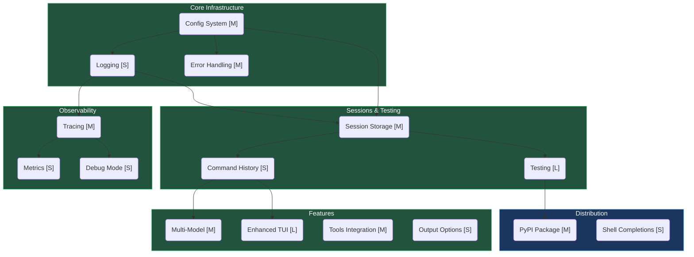
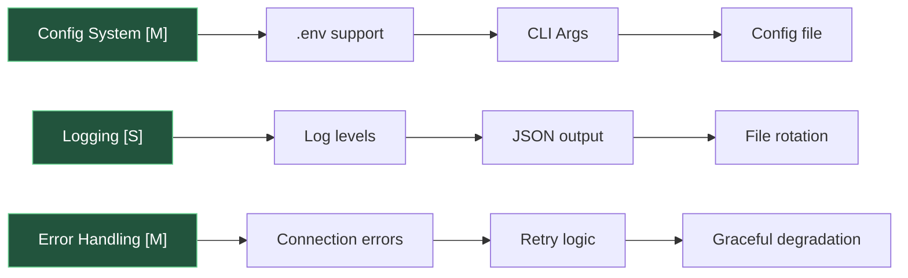
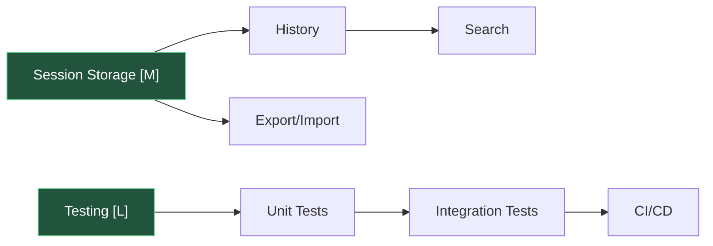
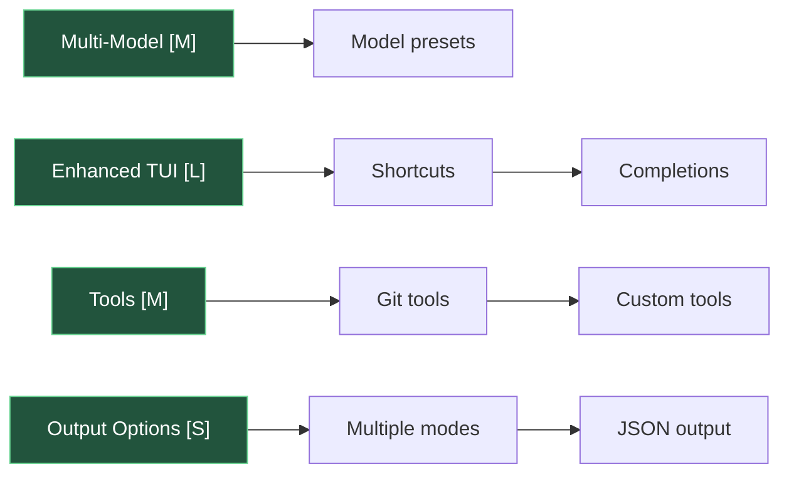
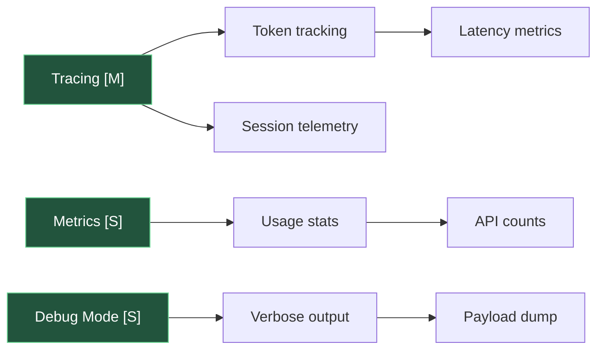
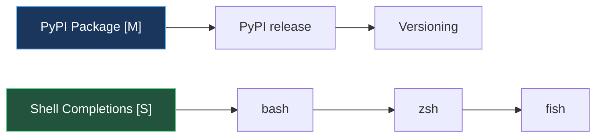
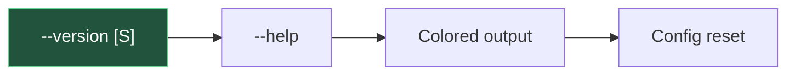
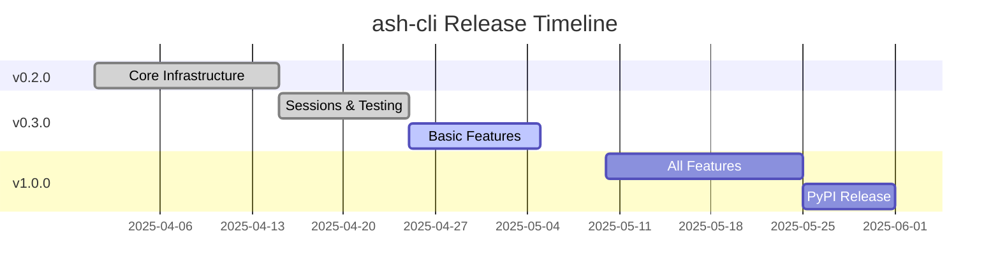

# ash-cli Roadmap

## Project Status

- **Type**: Local AI CLI agent using Agno + Qwen3.5-4B via llama.cpp
- **Current**: v1.0.0-rc1 - All core features, observability, and shell completions ready
- **Files**: 11 modules

## Legend

| Node Color | Status |
|-----------|--------|
| 🟢 Green | Complete |
| 🔵 Blue | In Progress / Current |
| ⚪ Gray | Planned / Not Started |

| Effort | Complexity |
|--------|------------|
| [S] Small | < 1 day |
| [M] Medium | 1-3 days |
| [L] Large | > 3 days |

---

## Dependency Graph

---

## Phase 1: Core Infrastructure

### Config System [M]

- [x] .env file support
- [x] CLI arguments (`--model`, `--temp`, etc.)
- [x] Config file (YAML/JSON)

### Logging [S]

- [x] Log levels (debug, info, warning, error)
- [x] JSON structured output
- [x] Log file rotation with size limit
- [x] Configurable format

### Error Handling [M]

- [x] Connection error handling
- [x] Retry logic with backoff
- [x] Graceful degradation
- [x] Input validation

---

## Phase 2: Sessions & Testing

### Session Storage [M]

- [x] Persist to file (JSON/SQLite)
- [x] Load previous sessions
- [x] Session naming
- [x] Export/import

### Testing [L]

- [x] Add pytest
- [x] Unit tests (config, agent, buffer, session, error, tui)
- [ ] Integration tests
- [x] GitHub Actions CI

---

## Phase 3: Features

### Multi-Model [M]

- [x] Multiple model support
- [x] Model switching
- [x] Model presets (in config)

### Enhanced TUI [L]

- [x] Keyboard shortcuts (vim bindings for scroll: j, k)
- [x] History search (with /)
- [x] Command completions (Tab)
- [ ] Better scroll (smooth scroll/page up-down)
- [x] Themes (dark/light/system)

### Tools Integration [M]

- [x] Git operations (status, diff, commit, push, log)
- [x] File previews
- [x] Custom tools registration

### Output Options [S]

- [x] Execute/Copy/Skip interactive prompt
- [ ] JSON output mode
- [ ] Pipe to other commands

---

## Phase 4: Observability

### Tracing [M]

- [x] Request/reponse tracing (Done via logger)
- [x] Token usage tracking
- [x] Latency metrics
- [x] Session telemetry (Done via /stats)

### Metrics [S]

- [x] Total tokens used (per session)
- [x] API call counts
- [x] Average response time
- [x] Session statistics

### Debug Mode [S]

- [x] Verbose flag (`-v`, `--debug`)
- [x] Dump payloads
- [x] Export session data
- [x] Connection diagnostics

---

## Phase 5: Distribution

### PyPI Package [M]

- [ ] Package to PyPI
- [ ] Release workflow
- [x] Version management

### Shell Completions [S]

- [x] Bash completion
- [x] Zsh completion
- [ ] Fish completion

---

## Quick Wins

- [x] Add `--version` flag [S]
- [x] Extended `--help` [S]
- [x] Colored command output [S]
- [x] Config reset command [S]

---

## Release Milestones

